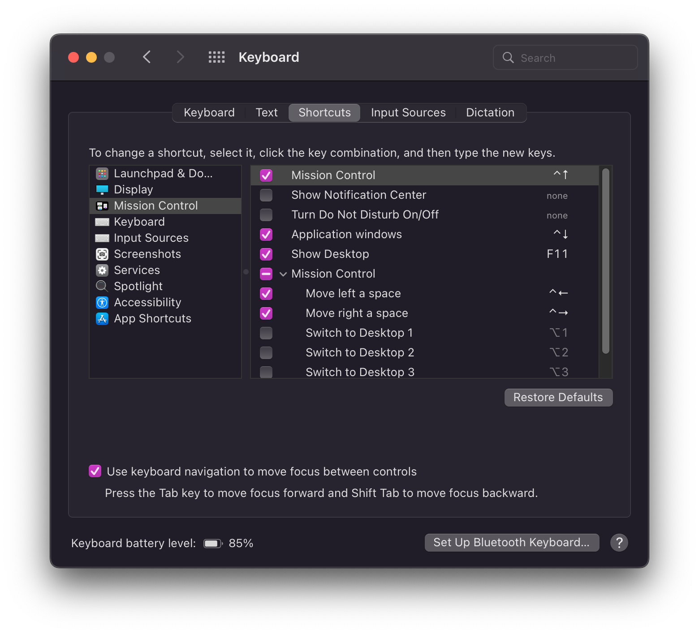

# go-spaces

macOS spaces can't easily be controlled via keyboard shortcuts. This tool is a bit of a hack to let you programatically:

- Switch to the last space you were on
- Switch to a space by number _without_ skipping fullscreen applications

The one keyboard interaction with macOS spaces that _does_ work well is switching to the previous/next space. This tool is quite simple: it remembers the space you're currently on, and generates the right number of "previous space"/"next space" commands to get you to the right target space.

## Prerequisites



Set up the ⌃← and ⌃→ shortcuts to move to the previous and next space

## Usage

```bash
# Set initial space number: what space am I on right now?
$ gspc set 1

# Switch to space 3
$ gspc switch 3
tell application "System Events"
  key code 124 using (control down)
  delay 0.1
  key code 124 using (control down)
  delay 0.1
end tell

# Switch to previous space
$ gspc prev
tell application "System Events"
  key code 123 using (control down)
  delay 0.1
  key code 123 using (control down)
  delay 0.1
end tell
```

Note that the tool outputs AppleScript, so pipe to [`osascript`](https://ss64.com/osx/osascript.html) or use something like [Keyboard Maestro](https://www.keyboardmaestro.com/main/) or [Alfred](https://www.alfredapp.com/) to actually execute it.

## Limitations
- You have to run `gspc set` if you ever change spaces _without_ using this tool
- A small delay needs to be inserted between every switch to account for animation delay/etc. because switching is not 100% reliable

## TODO
- [ ] Configurable delay
- [ ] Configurable file path